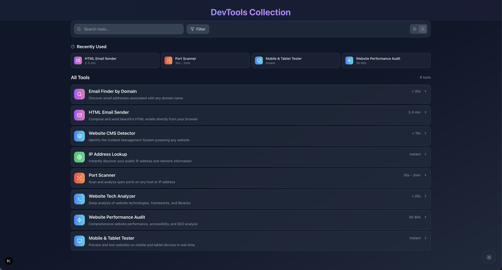

# DevTools Collection

<div align="center">
  
  <h3>A comprehensive suite of web analysis, development, and testing tools.</h3>
</div>

This collection provides a unified interface for essential utilities, from network diagnostics to website performance auditing.



## 🚀 Features & Tools

This collection includes 8 powerful tools:

### 🔍 Analysis Tools
- **Website CMS Detector**: Identify the Content Management System (WordPress, Shopify, etc.) powering any website.
- **Website Tech Analyzer**: Deep analysis of website technologies, frameworks, and libraries (TechScan).
- **Website Performance Audit**: Comprehensive performance, accessibility, and SEO analysis using Google Lighthouse.
- **Mobile & Tablet Tester**: Preview and test responsive designs on various mobile and tablet devices in real-time.

### 🌐 Network Tools
- **IP Address Lookup**: Instantly discover your public IP address, ISP, and network location information.

### 🛡️ Security Tools
- **Port Scanner**: Scan and analyze open ports on any host or IP address to identify potential security vulnerabilities.

### 📧 Communication Tools
- **Email Finder by Domain**: Discover email addresses associated with any domain name.
- **HTML Email Sender**: Compose and send beautiful HTML emails directly from your browser for testing or campaigns.

## 🛠️ Tech Stack

- **Framework**: [Next.js 15](https://nextjs.org/) (App Router)
- **Styling**: [Tailwind CSS](https://tailwindcss.com/)
- **Icons**: [Lucide React](https://lucide.dev/)
- **Deployment**: Docker & Docker Compose

## 📦 Getting Started

You can run the DevTools Collection using Docker (recommended) or locally with Node.js.

### Option 1: Docker (Recommended)

The easiest way to deploy is using Docker Compose.

1. **Clone the repository**
   ```bash
   git clone https://github.com/yourusername/it-tools.git
   cd it-tools
   ```

2. **Start the application**
   ```bash
   docker-compose up -d
   ```

3. **Access the tools**
   Open [http://localhost:3010](http://localhost:3010) in your browser.

### Option 2: Local Development

1. **Clone the repository**
   ```bash
   git clone https://github.com/yourusername/it-tools.git
   cd it-tools
   ```

2. **Install dependencies**
   ```bash
   npm install
   # or
   yarn install
   ```

3. **Run the development server**
   ```bash
   npm run dev
   ```

4. **Access the tools**
   Open [http://localhost:3000](http://localhost:3000) in your browser.

## 🔧 Configuration

The application works out-of-the-box for most tools, but some features (like sending emails and performance audits) require environment variables.

### Setting up Environment Variables

1. Create a file named `.env.local` in the root directory.
2. Add the following variables to configure the services:

```env
# 📧 SMTP Configuration (Required for HTML Email Sender)
# You can use any SMTP service like SendGrid, Mailgun, or Gmail (with App Password)
SMTP_HOST=smtp.example.com
SMTP_USER=your_email@example.com
SMTP_PASS=your_smtp_password
EMAIL_FROM=noreply@example.com

# ⚡ PageSpeed Insights API (Optional but recommended for Performance Audit)
# Get your key here: https://developers.google.com/speed/docs/insights/v5/get-started
PAGESPEED_API_KEY=your_google_api_key
```

### Docker Configuration

- **Port**: By default, the Docker container runs on port `3010`. You can change this in `docker-compose.yml`.
- **Environment Variables**: For Docker, you can pass these variables in your `docker-compose.yml` file or use a `.env` file referenced by Docker.

## 🤝 Contributing

Contributions are welcome! Please feel free to submit a Pull Request.

1. Fork the project
2. Create your feature branch (`git checkout -b feature/AmazingFeature`)
3. Commit your changes (`git commit -m 'Add some AmazingFeature'`)
4. Push to the branch (`git push origin feature/AmazingFeature`)
5. Open a Pull Request

## 📄 License

This project is licensed under the MIT License - see the [LICENSE](LICENSE) file for details.
